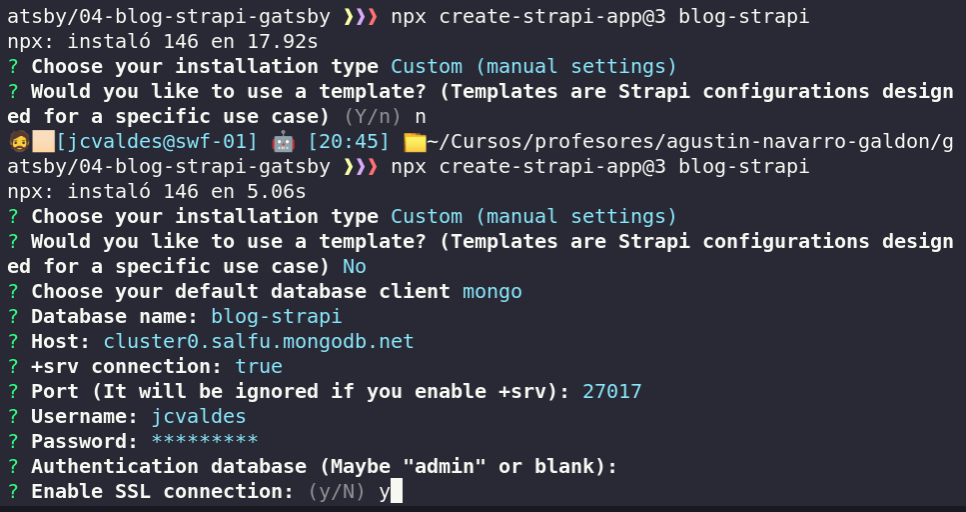
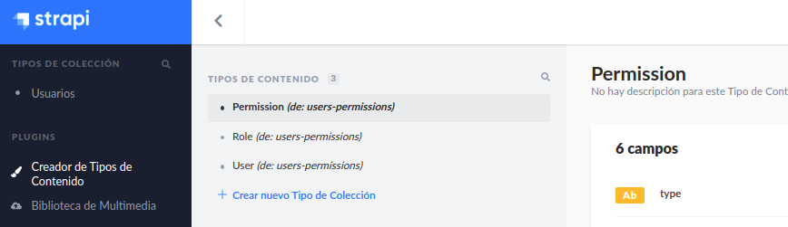
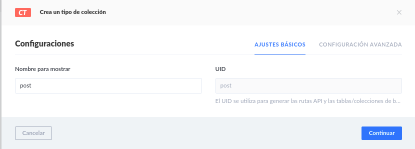
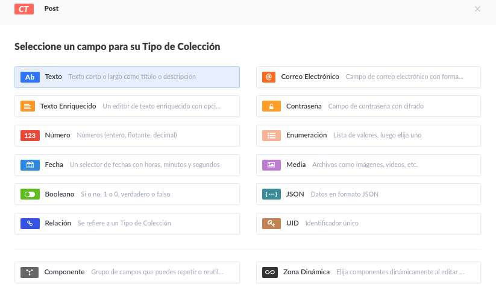
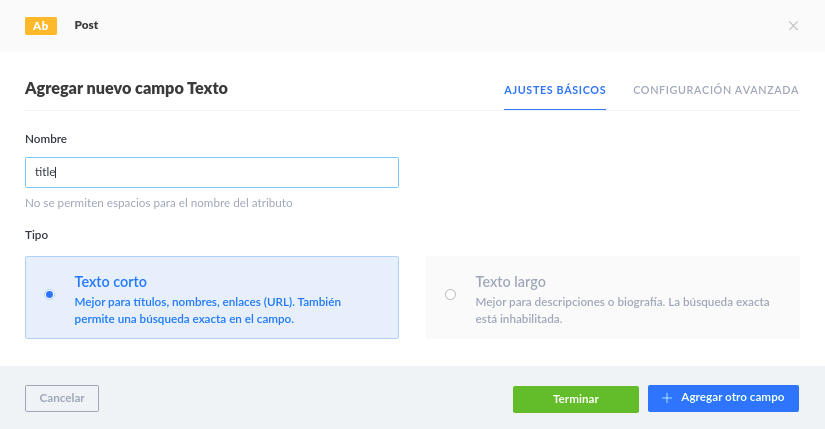
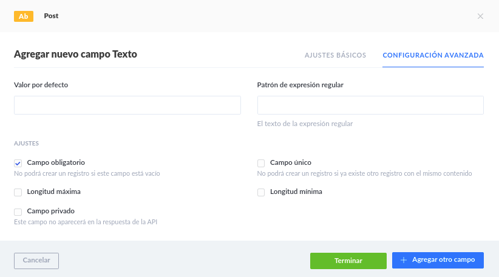
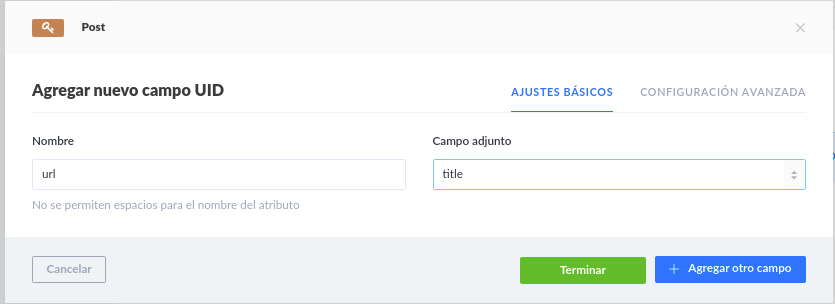

## Crear proyecto con mongo

```
npx create-strapi-app@3 blog-strapi
```



## Instalar plugin de graphql en tienda

1. Instalar graphql una vez instalado probar el playground
   http://localhost:1337/graphql

## Crear un modelo

Ir a crear nuevo Tipo de Colección











### Url amigables en base al titulo



## Proyecto gatsby 

gatsby new blog-gatsby