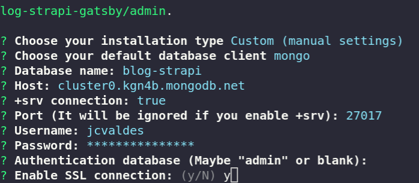

```
npm i -g  gatsby
```

gatsby new start
gatsby develop
yarn develop

## Strapi

para usar mongo usar la v3 por el momento
instalar

sudo apt-get install -y build-essential

npx create-strapi-app projectname



instalar

```
yarn add strapi-connector-mongoose
```

Verificar version de nodejs usar la 14.17.4 por el momento

En config/database.js

```
module.exports = ({ env }) => ({
  defaultConnection: "default",
  connections: {
    default: {
      connector: "mongoose",
      settings: {
        host: env("DATABASE_HOST", "cluster0.kgn4b.mongodb.net"),
        srv: env.bool("DATABASE_SRV", true),
        port: env.int("DATABASE_PORT", 27017),
        database: env("DATABASE_NAME", "blog-strapi"),
        username: env("DATABASE_USERNAME", "jcvaldes"),
        password: env("DATABASE_PASSWORD", "puvWpL3GUN2dec9"),
      },
      options: {
        authenticationDatabase: env("AUTHENTICATION_DATABASE", null),
        ssl: env.bool("DATABASE_SSL", true),
      },
    },
  },
});
```

puvWpL3GUN2dec9
cluster0.kgn4b.mongodb.net
